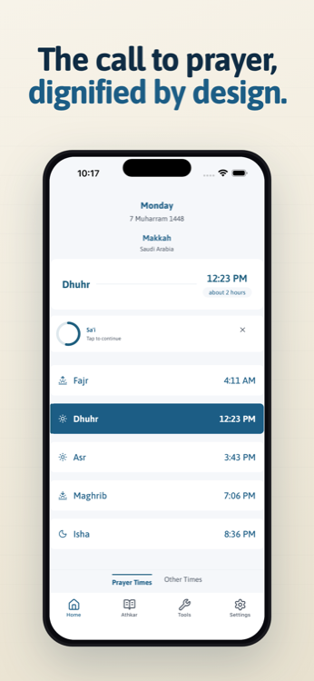
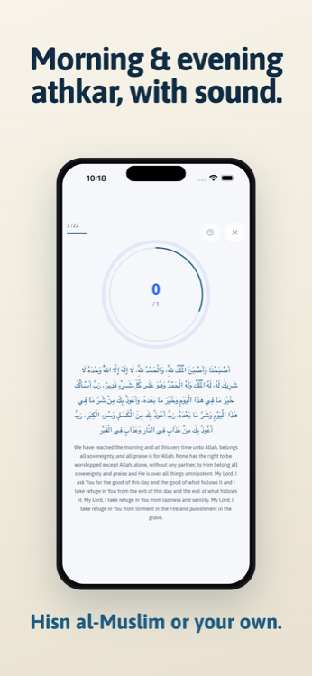
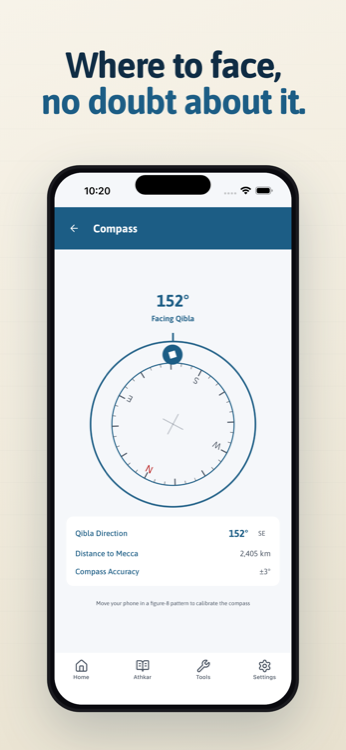

<h1 align="center"> Nedaa | نداء </h1>  

  <a href="https://nedaa.dev" target="_blank">
   <picture>
      <source media="(prefers-color-scheme: dark)" srcset="./assets/images/ios-dark.png">
      <source media="(prefers-color-scheme: light)" srcset="./assets/images/ios-light.png">
      
   </picture>
  </a>

  Prayer times, Athkar, Qibla, and reliable alarms for iOS and Android. 
  Free, no ads, no tracking, no accounts.

  <a href="https://apps.apple.com/app/id6740703900">App Store</a>
  &nbsp;·&nbsp;
  <a href="https://play.google.com/store/apps/details?id=dev.nedaa.android">Google Play</a>
  &nbsp;·&nbsp;
  <a href="https://appgallery.huawei.com/app/C114573733">AppGallery</a>
  &nbsp;·&nbsp;
  <a href="https://nedaa.dev">nedaa.dev</a>

  
  
  

## What it does

Nedaa tells you when to pray, wherever you are, and reminds you the way you want to be reminded. It's free, with no ads and no tracking, and there's no account to make.

Available for iOS and Android, including Huawei devices without Google services.

## Features

- Prayer times anywhere in the world, with 23 calculation methods so you can match your local mosque.
- Notifications for each prayer, with your own Athan sound, pre-prayer warnings, and Iqama reminders. All of it is set per prayer.
- A Fajr alarm that behaves like a real alarm instead of a notification, with an optional wake-up challenge.
- Home screen and lock screen widgets, including Suhoor and Iftar widgets during Ramadan.
- Morning and evening Athkar with audio, and you can add your own.
- Qibla compass.
- Hijri date, and a Hijri to Gregorian converter.
- Qada tracker for missed Ramadan fasts.
- A step-by-step Umrah guide.
- Countdowns to Ramadan, both Eids, Arafah, Ashura, and the Hijri new year.
- Arabic, English, Malay, and Urdu, with full RTL. [Want to see the app in your language?](#translation)
- Works offline once your prayer times are synced.

A Mushaf reader with recitation audio is in beta testing and ships soon.

## Built with

Expo and React Native, TypeScript, Tamagui for the UI, Zustand for state, and SQLite for local storage. The alarms, compass, and widgets are native modules under `modules/`.

Setup instructions are in the [Developer Guide](./docs/DEV-README.md).

## Permissions

Android counts every permission an app declares, including the ones libraries merge in, so the number on the store page looks larger than it is. Here is what each one is actually for, and where in the code it is used.

### Android

| Permission                                                                         | Used for                                                                                                                                                                                                                                                                                                      | Where                                                                                                                                 |
| ---------------------------------------------------------------------------------- | ------------------------------------------------------------------------------------------------------------------------------------------------------------------------------------------------------------------------------------------------------------------------------------------------------------- | ------------------------------------------------------------------------------------------------------------------------------------- |
| `ACCESS_COARSE_LOCATION`, `ACCESS_FINE_LOCATION`                                   | Two separate uses, both only while the app is open. Prayer times take a **low-accuracy**, city-level fix. The Qibla compass asks for one **precise** fix, and only after you pick Qibla mode — it is kept on your device, reused offline, and dropped after a day. Compass-only mode never requests location. | [`src/utils/location.ts`](src/utils/location.ts), [`src/hooks/useCompassLocation.ts`](src/hooks/useCompassLocation.ts)                |
| `INTERNET`                                                                         | Fetching prayer times, downloading Quran content, sending feedback you choose to send.                                                                                                                                                                                                                        | [`src/services/api.ts`](src/services/api.ts)                                                                                          |
| `SCHEDULE_EXACT_ALARM`, `USE_EXACT_ALARM`                                          | Firing the Athan and alarms at the exact minute. Android defers inexact alarms, which is no good for Fajr.                                                                                                                                                                                                    | [`modules/expo-alarm/android/.../AlarmScheduler.kt`](modules/expo-alarm/android/src/main/java/expo/modules/alarm/AlarmScheduler.kt)   |
| `RECEIVE_BOOT_COMPLETED`                                                           | Re-scheduling your alarms after the phone restarts. Without it they'd silently stop.                                                                                                                                                                                                                          | [`modules/expo-alarm/android/.../BootReceiver.kt`](modules/expo-alarm/android/src/main/java/expo/modules/alarm/BootReceiver.kt)       |
| `SYSTEM_ALERT_WINDOW`                                                              | Showing the alarm screen over the lock screen when it goes off.                                                                                                                                                                                                                                               | [`android/.../MainActivity.kt`](android/app/src/main/java/dev/nedaa/android/MainActivity.kt)                                          |
| `REQUEST_IGNORE_BATTERY_OPTIMIZATIONS`                                             | Optional, and you're asked before it's used. It tells Android not to hold back your alarms while the phone is idle.                                                                                                                                                                                           | [`modules/expo-alarm/android/.../ExpoAlarmModule.kt`](modules/expo-alarm/android/src/main/java/expo/modules/alarm/ExpoAlarmModule.kt) |
| `READ_MEDIA_AUDIO`, `READ_EXTERNAL_STORAGE`, `WRITE_EXTERNAL_STORAGE`              | Letting you use your own audio file as an Athan sound. Only the file you pick is read.                                                                                                                                                                                                                        | [`src/utils/customSoundManager.ts`](src/utils/customSoundManager.ts)                                                                  |
| `MODIFY_AUDIO_SETTINGS`, `FOREGROUND_SERVICE`, `FOREGROUND_SERVICE_MEDIA_PLAYBACK` | Playing Athkar and Quran recitation, and keeping the lock screen controls working while playback continues in the background.                                                                                                                                                                                 | [`src/services/audio/nitroSession.ts`](src/services/audio/nitroSession.ts)                                                            |
| `VIBRATE`                                                                          | Haptics, and vibration on notifications and alarms.                                                                                                                                                                                                                                                           | [`src/hooks/useHaptic.ts`](src/hooks/useHaptic.ts)                                                                                    |

Nedaa does not ask for the microphone, camera, contacts, or activity recognition. `RECORD_AUDIO`, `ACTIVITY_RECOGNITION`, and `FOREGROUND_SERVICE_DATA_SYNC` are pulled in by libraries and stripped from the build on purpose — see `blockedPermissions` in [`app.json`](app.json).

### iOS

| Capability             | Used for                                                                                                                                                                                                   | Where                                                                                                                  |
| ---------------------- | ---------------------------------------------------------------------------------------------------------------------------------------------------------------------------------------------------------- | ---------------------------------------------------------------------------------------------------------------------- |
| Location, while in use | Prayer times at low accuracy, plus one precise fix for the Qibla compass if you opt into Qibla mode. The compass fix stays on device and is dropped after a day. There's no "always" prompt in normal use. | [`src/utils/location.ts`](src/utils/location.ts), [`src/hooks/useCompassLocation.ts`](src/hooks/useCompassLocation.ts) |
| Notifications          | Athan, pre-prayer warnings, Iqama reminders, and reading reminders.                                                                                                                                        | [`src/utils/notifications.ts`](src/utils/notifications.ts)                                                             |
| Background audio       | Athkar and Quran recitation keep playing when you leave the app, with lock screen controls.                                                                                                                | [`src/services/audio/nitroSession.ts`](src/services/audio/nitroSession.ts)                                             |
| Background refresh     | Topping up cached prayer times so they're there when you're offline.                                                                                                                                       | [`src/tasks/backgroundRefresh.ts`](src/tasks/backgroundRefresh.ts)                                                     |
| AlarmKit (iOS 26+)     | Real system alarms for Fajr and Jummah. On earlier iOS the alarm feature is turned off rather than faked.                                                                                                  | [`modules/expo-alarm`](modules/expo-alarm)                                                                             |

### Checking for yourself

On Android, [Exodus Privacy](https://reports.exodus-privacy.eu.org/en/reports/dev.nedaa.android/latest/) analyses the published APK and reports **no trackers**.

No equivalent exists for iOS — Apple encrypts app binaries, so nobody outside Apple can analyse them. What we can do instead is ship the declaration in the open: [`ios/nedaa/PrivacyInfo.xcprivacy`](ios/nedaa/PrivacyInfo.xcprivacy) lists no collected data types, no tracking domains, and `NSPrivacyTracking` set to false. Since the app is open source, you can read it, and the code behind it, rather than taking our word for it.

## Acknowledgements

Nedaa is built on the generous work of others:

**Qur'an**

- **Qur'an text** — [Tanzil.net](https://tanzil.net).
- **Mushaf layout & font** — [King Fahd Glorious Qur'an Printing Complex (KFGQPC)](https://qurancomplex.gov.sa) — UthmanicHafs font and page layout.
- **Verse metadata & recitation timing** — [Qur'anic Universal Library (QUL)](https://qul.tarteel.ai) by Tarteel.
- **Recitation** — recitation audio from [QuranicAudio](https://quranicaudio.com) and [quran.com](https://quran.com), mirrored via QUL.

**Fonts**

- [IBM Plex Sans Arabic](https://github.com/IBM/plex) — SIL Open Font License 1.1.
- [Asap](https://fonts.google.com/specimen/Asap) — SIL Open Font License 1.1.

**Tools**

- [Crowdin](https://crowdin.com) — free access to their localization platform through their open source program.

## Feedback

If there is a feature you would like to see in the app, please let us know <a target="_blank" href="mailto: support@nedaa.dev">support@nedaa.dev</a>. We are always looking for ways to improve the app.
Also pull request are welcome.
 
If you find any issue please [file an issue](https://github.com/nedaaDevs/nedaa/issues/new).

If you have any questions, feel free to reach us at <a target="_blank" href="mailto: support@nedaa.dev">support@nedaa.dev</a>

## Translation

If you would like to see the app in your language, you can contribute very easily by joining our [crowdin project](https://crowdin.com/project/nedaa-v2/invite?h=ab811dde9acfea7c0086a694e94f75ca2468850).

Select the language you want, and submit translations to the strings in the app.

If you don't see your language in the crowdin project, you can create a new ["discussion"](https://crowdin.com/project/nedaa-v2/discussions) in the crowdin project, and we will add the language for you.

### Maintaining translations

`en.json` is the source of truth and the only file developers edit by hand (Arabic, `ar.json`, is also hand-maintained by the team). The remaining locales are owned by Crowdin — never edit those files directly, they are overwritten on the next download.

The flow:

- Once new English strings land on `master`, Crowdin picks them up for translation on its own.
- Crowdin keeps a single PR open from its `l10n_master` branch. Merge it into `master` before each release (merge, don't delete the branch — Crowdin reuses it). Letting it sit lets the branch drift behind `master`.

A locale only becomes selectable when it's listed in `AppLocale` (`src/enums/app.ts`) — both the language picker and the device-default resolver derive from that enum. Keep a locale gated there until its Crowdin coverage is ship-ready.
